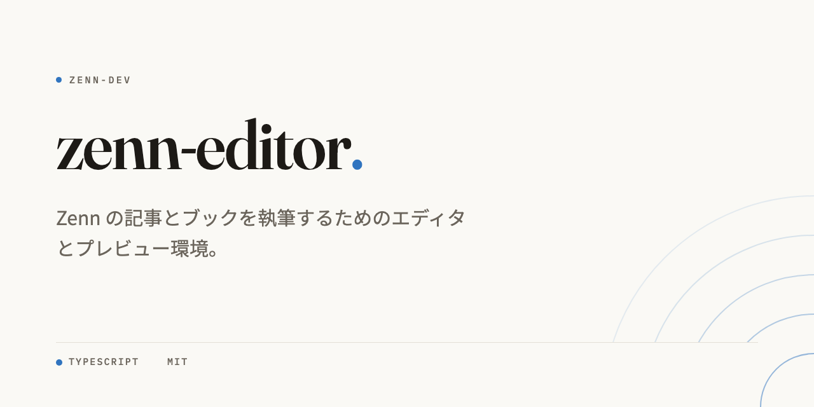

# Cover My Repo

**クリックしたくなる GitHub ソーシャルプレビューを作ります。**

[English](README.md) | [한국어](README.ko.md) | [简体中文](README.zh-CN.md)


## すぐに実行

```sh
npx cover-my-repo
```

Git リポジトリ内で実行します。認証済みの Codex または Cursor CLI を
検出し、3 つのデザインを作り、ローカルの Chrome で描画して比較画面を
開きます。

画像モデルは使わず、リポジトリの認証情報も渡しません。

Node.js 20 と Chrome が必要です。GitHub の
**Settings → Social preview** へのアップロードは手動なので、確認なしで
リポジトリ設定が変わることはありません。


## 作られるもの

- 自己完結した HTML デザイン 3 つ
- ローカル Chrome で描画した 1280x640 PNG 3 枚
- 原寸とフィード幅を並べる比較ページ
- コントラスト、CJK 改行、キャンバス寸法の決定的チェック

最後の GitHub アップロードは CLI が代行しません。

## 5 つのムード

すべての例は [ギャラリー](https://sjh9714.github.io/cover-my-repo/) で
ライブページとして確認できます。

| | |
|---|---|
| **editorial**。温かい紙色、Fraunces のワードマーク、控えめな同心円 |  |
| **poster**。言語カラーを混ぜた深い背景と大きく切り取った頭文字 |  |
| **blueprint**。ネイビーの方眼、等幅書体、コーナーティック、図面番号 |  |
| **gallery**。中央揃えの細いセリフで組む美術館の作品ラベル |  |
| **terminal**。ウィンドウクロームと EXIT 0 を備えた端末セッション |  |

アクセントは主要言語から選ばれます。細部はリポジトリ名から決まるため、
同じ設計体系を保ちながら複製のようには見えません。

## エージェントスキルとして使う

従来の `repo-cover` スキルも引き続き使えます。互換性のため内部名は
変更しません。

```sh
# Agent Skills CLI
npx skills add sjh9714/cover-my-repo

# Claude Code プラグインマーケットプレイス
/plugin marketplace add sjh9714/cover-my-repo
/plugin install repo-cover@repo-cover

# Codex
codex plugin marketplace add sjh9714/cover-my-repo
codex plugin add repo-cover@repo-cover
```

インストール後、エージェントにリポジトリのソーシャルプレビューを作る
よう頼みます。

## チェックされるルール

- カード 1 枚にアクセント 1 色と WCAG コントラスト
- 名前の長さに応じた 132px から 64px のタイトル
- 説明文は 110 文字、CJK は 60 文字まで
- 影、グラデーション、ガラス効果、絵文字は禁止
- すぐ古くなるスター数は初期状態で非表示

`skills/repo-cover/scripts/check_card.py` がキャンバス寸法、自己完結性、
コントラスト、CJK 改行、縮小時の可読性を検査します。

## CJK 対応



日本語は Noto Sans JP と適切な禁則処理を使います。韓国語は Noto Sans KR、
中国語は Noto Sans SC と、それぞれの改行規則を使います。

## カードを再描画する

同梱の Action で既存の HTML カードを CI 上でもう一度描画できます。

```yaml
- uses: sjh9714/cover-my-repo@main
  with:
    card: assets/my-repo-cover.html
    output: cover.png
```

## 使わない方がよい場合

- チャートや構成図にはダイアグラムツールが適しています。
- ロゴやマスコットには画像生成ツールが適しています。
- 外部共有しない非公開リポジトリなら GitHub の標準カードで十分です。

## ライセンス

MIT
