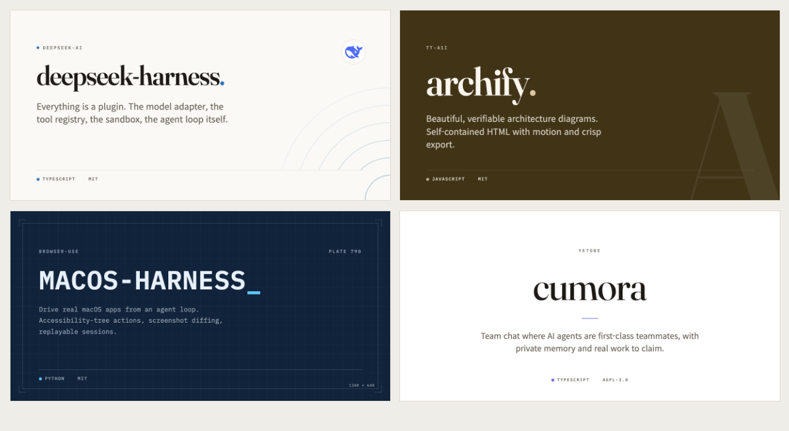
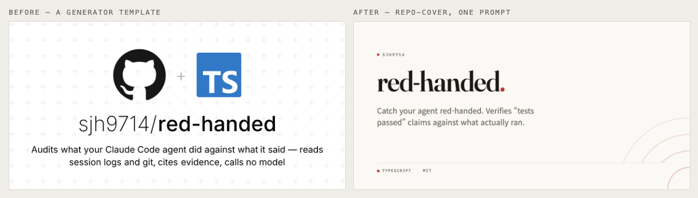
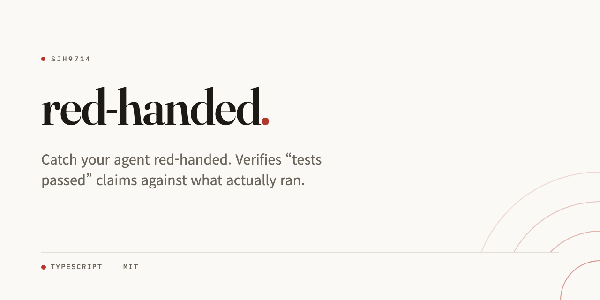
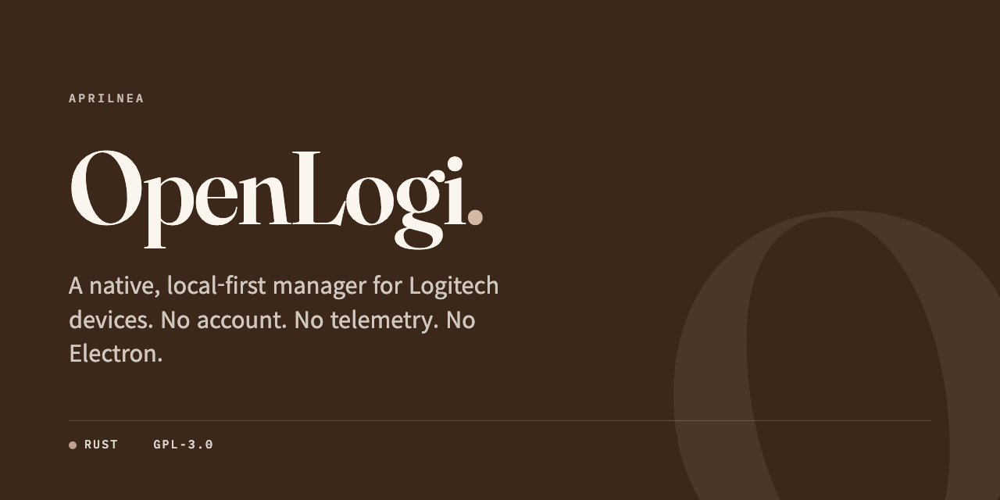
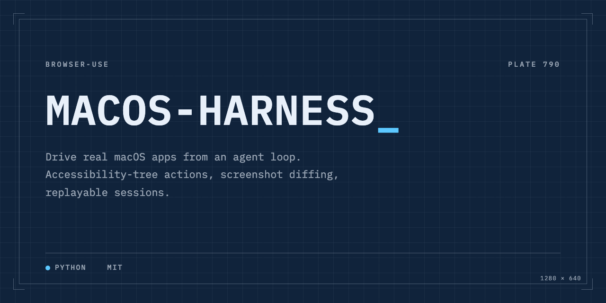
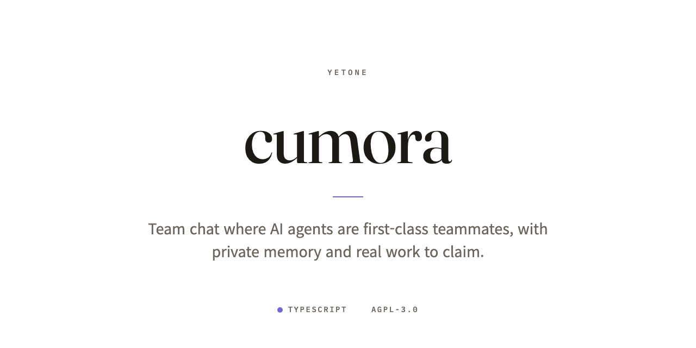
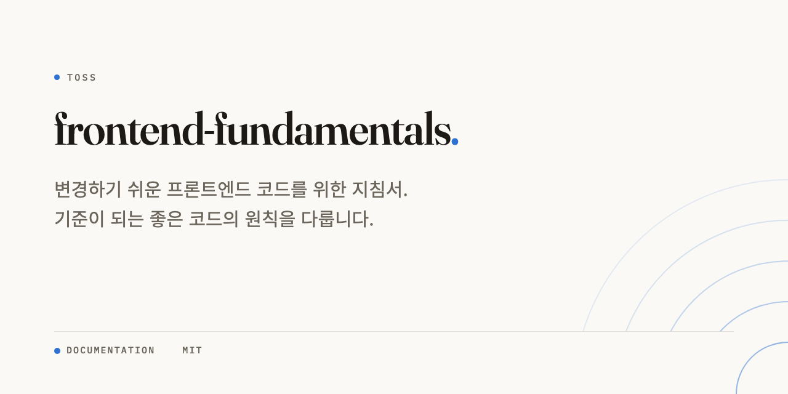

# repo-cover

**당신의 레포 소셜 프리뷰를 잡지 마스트헤드처럼. 코딩 에이전트가
자기 손으로 쓰는 자기완결 HTML 한 파일.**

X, 슬랙, 디스코드에 레포 링크를 붙일 때마다 카드가 보입니다. 지금
그 카드는 GitHub 자동 생성 기본값이거나, 남들과 똑같은 생성기
템플릿입니다. 이 스킬은 에이전트가 카드를 직접 *디자인*하게
만듭니다. 진짜 타이포그래피 위계, 언어 색에서 가져온 악센트 하나,
그리고 모델이 대충 못 하게 막는 결정적 검사까지.

[English](README.md)





## 설치

```sh
# Agent Skills CLI (Claude Code, Codex, Cursor, opencode, ...)
npx skills add sjh9714/repo-cover

# Claude Code 플러그인 마켓플레이스
/plugin marketplace add sjh9714/repo-cover
/plugin install repo-cover@repo-cover

# Codex
codex plugin marketplace add sjh9714/repo-cover
codex plugin add repo-cover@repo-cover

# Pi
pi install https://github.com/sjh9714/repo-cover
```

설치 후 레포에서:

> 이 레포 소셜 프리뷰 카드 만들어줘.

에이전트가 레포 정보를 모으고, 설명을 한 줄로 다듬고,
`<repo>-cover.html`을 쓰고, 검사를 돌리고, 1280x640 PNG로
내보냅니다. **Settings → Social preview** 에 업로드하면 끝.

## 네 가지 무드

| | |
|---|---|
| **editorial** (기본) — 따뜻한 종이색, Fraunces 워드마크, 모서리에서 번지는 동심원 |  |
| **poster** — 언어 색을 섞어 만든 딥 컬러 필드, 레포 첫 글자를 크롭한 워터마크 |  |
| **blueprint** — 네이비 그리드, 모노 타입, 코너 틱, 레포 이름에서 유도한 도면 번호 |  |
| **gallery** — 미술관 벽 라벨. 순백, 중앙 정렬, 가는 세리프 |  |

카드 두 장이 같아지는 일은 없습니다. 악센트는 주 언어에서, 동심원과
도면 번호는 레포 이름 해시에서, 포스터 워터마크는 레포 자신의
글자에서 나옵니다.

## 강제되는 것들

모델의 재량이 아니라 숫자로 박혀 있습니다.

- 모든 좌표와 크기는 4px 그리드
- 카드당 악센트 하나, WCAG 대비 통과까지 자동으로 어둡게
- 이름 길이별 제목 크기 티어 (132px에서 64px까지, 26자 초과는 두 줄)
- 설명 110자 예산 (CJK는 60자), 최대 두 줄
- 그림자, 그라데이션, 글래스모피즘, 이모지 금지
- 스타 수는 **기본 꺼짐** — 금방 낡고, 어린 레포를 민망하게 만듭니다

`scripts/check_card.py`가 전부 결정적으로 검사합니다. 캔버스 크기,
자기완결성, 대비, CJK 줄바꿈, X의 506px 카드 폭 축소 가독성까지.

## CJK가 일급입니다



한국어는 `word-break:keep-all`, +1px 광학 보정, Noto Sans KR.
일본어와 중국어는 Noto Sans JP/SC와 각자의 줄바꿈 규칙.
두부 글자 폴백이 아닙니다. `references/cjk.md` 참고.

## 신선하게 유지하기

카드는 의도적으로 정적 파일입니다. 동봉된 컴포짓 액션이 CI에서
다시 렌더링해 폴백 폰트가 실려 나가는 일을 막고, 설명이 자주
바뀌면 스케줄로도 돌릴 수 있습니다.

```yaml
- uses: sjh9714/repo-cover@main
  with:
    card: assets/my-repo-cover.html
    output: cover.png
```

## 이럴 땐 쓰지 마세요

- 다이어그램이나 차트가 필요하면 다이어그램 스킬을 쓰세요.
- 로고나 마스코트가 필요하면 이미지 생성 스킬을 쓰세요.
- 비공개 레포라 링크될 일이 없다면 기본 카드로 충분합니다.

## 라이선스

MIT
