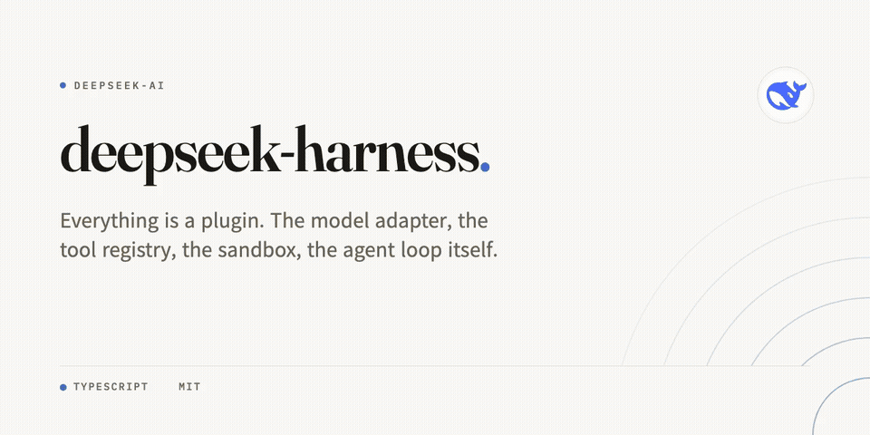
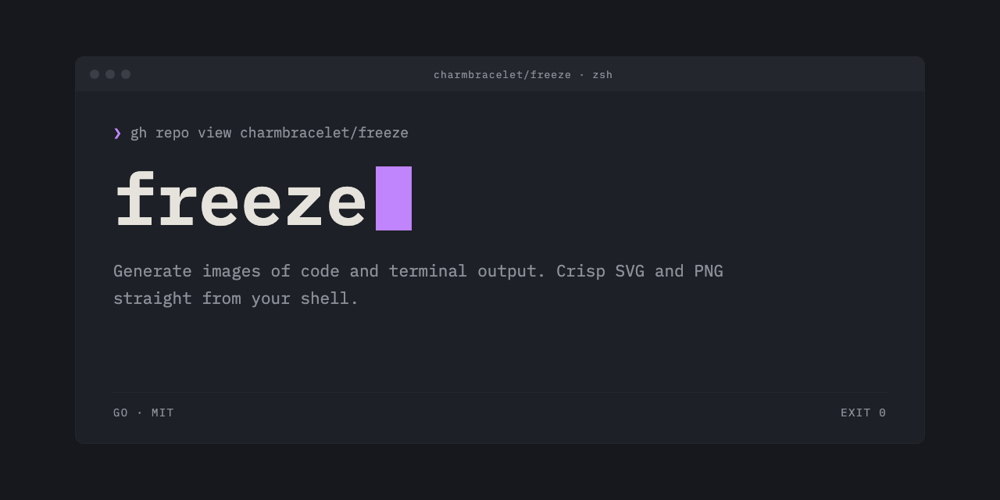

# repo-cover

**Your repo's social preview, designed like a magazine masthead, written
by your coding agent as one self-contained HTML file.**

Every link to your repo on X, Slack, or Discord shows a card. Right now
yours is either GitHub's auto-generated default or a generator template
that looks like everyone else's. This skill has your agent *design* the
card instead, with real typographic hierarchy, an accent color taken
from your language, and deterministic checks that keep the model honest.

[한국어](README.ko.md) | [日本語](README.ja.md) | [简体中文](README.zh-CN.md)




## Install

```sh
# Agent Skills CLI (Claude Code, Codex, Cursor, opencode, ...)
npx skills add sjh9714/repo-cover

# Claude Code plugin marketplace
/plugin marketplace add sjh9714/repo-cover
/plugin install repo-cover@repo-cover

# Codex
codex plugin marketplace add sjh9714/repo-cover
codex plugin add repo-cover@repo-cover

# Pi
pi install https://github.com/sjh9714/repo-cover

# fx (vercel-labs/fx)
/skills install sjh9714/repo-cover --skill repo-cover
```

Then, in your repo:

> Make a social preview card for this repo.

The agent gathers the facts, rewrites your description into one tight
line, writes `<repo>-cover.html`, checks it, and exports a 1280x640 PNG
you upload under **Settings → Social preview**.

## Five moods

Every example is a live page in the [gallery](https://sjh9714.github.io/repo-cover/). Click through and view source.

| | |
|---|---|
| **editorial** (default). Warm paper, a Fraunces wordmark, arcs from the corner |  |
| **poster**. A deep field mixed from your language color, your first letter as a cropped watermark |  |
| **blueprint**. Navy grid, mono type, corner ticks, a plate number derived from your repo name |  |
| **gallery**. A museum wall label. Pure white, centered, light serif |  |
| **terminal**. The repo as a terminal session, window chrome, block cursor, EXIT 0 |  |

No two cards match. The accent comes from your primary language, the
arcs and plate numbers are seeded by your repo name, and the poster
watermark is your own letterform.

## What it enforces

The model does not freestyle. The skill pins:

- a 4px grid for every coordinate and size
- one accent per card, auto-darkened until it passes WCAG contrast
- title size tiers by name length (132px down to 64px, two lines past 26 chars)
- a 110-character description budget (60 for CJK), two lines max
- no shadows, no gradients, no glassmorphism, no emoji
- star counts **off by default**, since they go stale and embarrass young repos

`scripts/check_card.py` verifies it all deterministically. It checks
canvas size, self-containment, contrast ratios, CJK line-breaking, and
downscale legibility at X's 506px card width. FAILs get repaired, twice, then
reported honestly.

## CJK is first-class


Korean gets `word-break:keep-all`, a +1px optical bump, and Noto Sans KR
instead of a tofu fallback. Japanese and Chinese swap in Noto Sans JP/SC with
their own line-breaking rules. See `references/cjk.md`.

## Keep it fresh

The card is a static file by design. The bundled composite Action
re-renders it in CI so the PNG never ships with fallback fonts, and can
run on a schedule if your description changes often:

```yaml
- uses: sjh9714/repo-cover@main
  with:
    card: assets/my-repo-cover.html
    output: cover.png
```

## When not to use this

- You want diagrams or charts. Use a diagram skill.
- You want a logo or mascot. Use an image-generation skill.
- Your repo is private and nothing ever links to it. The default
  card is fine, save the tokens.

## License

MIT
