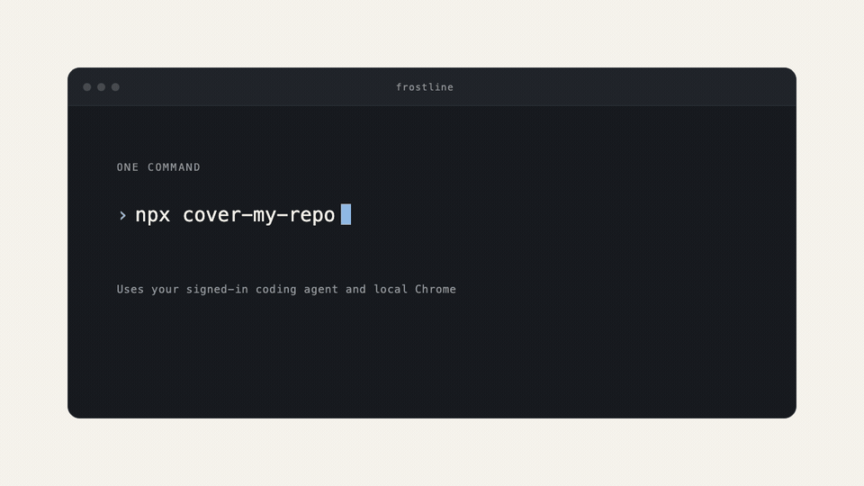
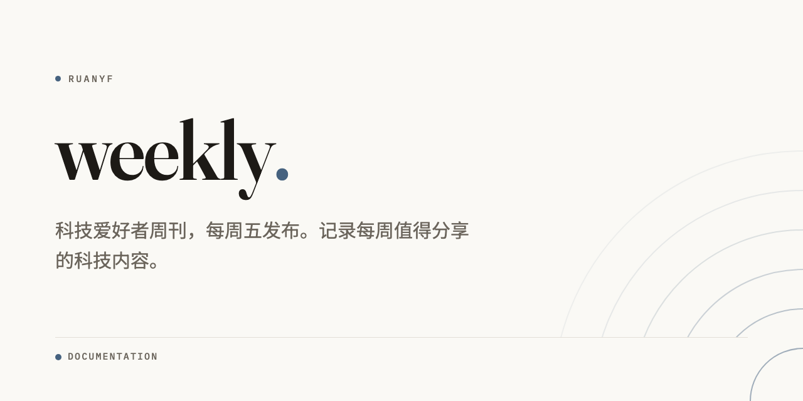

# Cover My Repo

**给 GitHub 仓库做一张值得点击的社交预览图。**

[English](README.md) | [한국어](README.ko.md) | [日本語](README.ja.md)



## 直接运行

```sh
npx cover-my-repo
```

在 Git 仓库内运行。它会检测已登录的 Codex 或 Cursor CLI，生成
三个设计方案，使用本机 Chrome 渲染，然后打开对比页面。

它不使用图像模型，也不会传递仓库凭据。

需要 Node.js 20 和 Chrome。上传到 GitHub 的
**Settings → Social preview** 仍由你手动完成，因此不会在未经确认时修改
仓库设置。


## 生成内容

- 三个自包含 HTML 设计方案
- 三张由本机 Chrome 渲染的 1280x640 PNG
- 同时展示原尺寸与信息流尺寸的对比页面
- 对比度、CJK 换行和画布尺寸的确定性检查

最后的 GitHub 上传不会由 CLI 代劳。

## 五种风格

所有示例都能在[画廊](https://sjh9714.github.io/cover-my-repo/)中作为
实时页面查看。

| | |
|---|---|
| **editorial**。暖纸色、Fraunces 字标、克制的角落同心圆 |  |
| **poster**。由语言颜色调出的深色背景与放大的首字母 |  |
| **blueprint**。藏青方格、等宽字体、角标与图号 |  |
| **gallery**。采用居中细衬线的美术馆作品标签 |  |
| **terminal**。带窗口装饰和 EXIT 0 的终端会话 |  |

强调色来自主要语言。布局细节由仓库名决定，因此既保持统一的设计体系，
又不会像复制的模板。

## 作为智能体技能使用

原有 `repo-cover` 技能仍然可用。为了兼容，内部名称不会改变。

```sh
# Agent Skills CLI
npx skills add sjh9714/cover-my-repo

# Claude Code 插件市场
/plugin marketplace add sjh9714/cover-my-repo
/plugin install repo-cover@repo-cover

# Codex
codex plugin marketplace add sjh9714/cover-my-repo
codex plugin add repo-cover@repo-cover
```

安装后，让智能体为当前仓库制作社交预览图即可。

## 检查规则

- 每张卡片只用一个强调色并满足 WCAG 对比度
- 按名称长度使用 132px 到 64px 的标题字号
- 描述限制为 110 字符，CJK 限制为 60 字符
- 禁止阴影、渐变、玻璃效果和 emoji
- 容易过时的星标数默认隐藏

`skills/repo-cover/scripts/check_card.py` 会检查画布尺寸、自包含、
对比度、CJK 换行和缩小后的可读性。

## CJK 支持



中文使用 Noto Sans SC 和对应的换行规则。日文使用 Noto Sans JP，韩文
使用 Noto Sans KR 与 `word-break:keep-all`。

## 重新渲染卡片

可以使用内置 Action 在 CI 中重新渲染已有 HTML 卡片。

```yaml
- uses: sjh9714/cover-my-repo@main
  with:
    card: assets/my-repo-cover.html
    output: cover.png
```

## 不适合使用的情况

- 图表和架构图更适合使用图表工具。
- logo 或吉祥物更适合使用图像生成工具。
- 从不对外分享的私有仓库使用 GitHub 默认卡片即可。

## 许可

MIT
